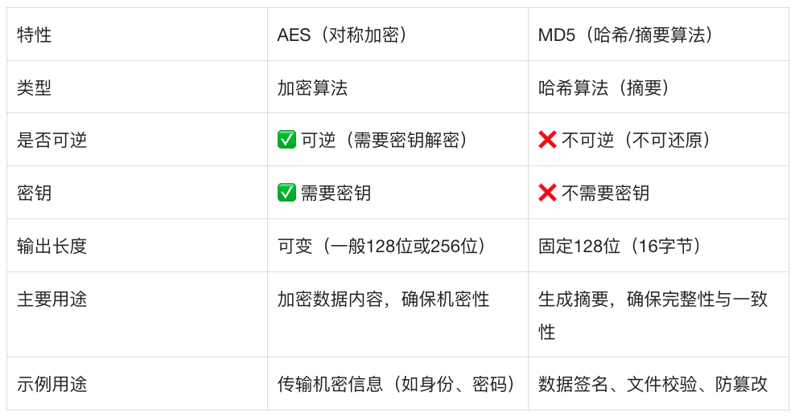
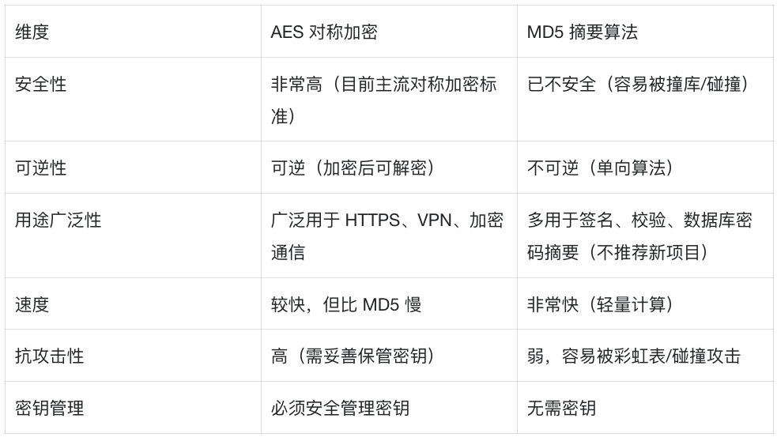
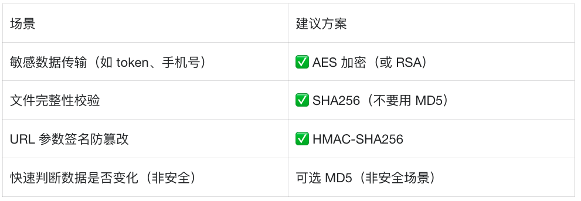

## webpack打包-Demo  （基于crypto-js 加密+签名）

#### 准备
```base
Node v16.17.0
```
#### 创建文件夹
```bash
mkdir wb_sdk
cd wb_sdk
npm init -y
npm install webpack webpack-cli --save-dev
```

#### 🌟可选安装 (选择性安装)
```js
     
// Babel 转换 ES6+, 配合 .babelrc 或 babel.config.js 使用 
npm i -D babel-loader @babel/core @babel/preset-env             

// CSS 支持, 支持导入 .css 文件
npm i -D style-loader css-loader

// 本地开发服务, 提供热更新和本地访问
npm i -D webpack-dev-server

// TypeScript, 支持 .ts 文件打包
npm i -D typescript ts-loader

// crypto-js 加密，使用 AES加密/解密
npm install crypto-js

// 用于压缩和优化 JavaScript 代码，支持 ES6+ 语法
npm install --save-dev webpack webpack-cli terser-webpack-plugin

// html模版
npm install --save-dev html-webpack-plugin
```


#### 目录结构
```bash
webpack-demo/
├── dist/                # 打包输出目录
├── src/                 # 源码目录
│   └── index.js         # 入口文件
├── index.html           # 本地测试用
├── webpack.config.js    # Webpack 配置文件
└── package.json
```

#### Webpack 配置
```js
// webpack.config.js
const path = require('path');
const TerserPlugin = require('terser-webpack-plugin');
const HtmlWebpackPlugin = require('html-webpack-plugin');

const baseConfig = {
  entry: './src/index.js',
  output: {
    // 如果你用 Webpack 构建 SDK 并希望浏览器直接使用，需配置 library + libraryTarget: 'umd'
    library: 'JYFSDK', // 注：这里配置的name,用在index.html引用时 new JYFSDK({...})
    libraryTarget: 'umd',
    globalObject: 'this',
    path: path.resolve(__dirname, 'dist'),
  },
  externals: {
    // 如果你不希望把 crypto-js 打包进去，可启用这一行：
    // 'crypto-js': 'CryptoJS',
  },
};

module.exports = [
  {
    ...baseConfig,
    mode: 'development',
    devServer: {
      static: path.resolve(__dirname, './'),
      port: 8086,
      open: true,   // 自动打开浏览器
      hot: true,    // 热更新
    },
    output: {
      ...baseConfig.output,
      filename: 'bundle-sdk.js',
    },
    plugins: [
      new HtmlWebpackPlugin({
        template: './index.html', // 同样可用于产物预览（可选）
        filename: 'index.html',
      }),
    ],
  },
  {
    ...baseConfig,
    mode: 'production',
    output: {
      ...baseConfig.output,
      filename: 'bundle-sdk.min.js',
    },
    plugins: [
      new HtmlWebpackPlugin({
        template: './index.html', // 同样可用于产物预览（可选）
        filename: 'index.html',
        inject: 'head',  // body：插入到body闭合标签前；head: 插入到 <head> 标签中（不推荐，可能阻塞渲染)
        scriptLoading: 'blocking', // 不加 defer！
      }),
    ],
    optimization: {
      minimize: true,
      minimizer: [new TerserPlugin({
        extractComments: false,
        terserOptions: {
          format: {
            comments: '/@license/i', // 保留合法 License
          }
        }
      })],
    },
  },
];
```

#### 服务端验签伪码（Node.js 示例）
```js
const crypto = require('crypto');
const CryptoJS = require('crypto-js');

// 解密
function decrypt(ciphertext, aesKey) {
  const bytes = CryptoJS.AES.decrypt(ciphertext, aesKey);
  return JSON.parse(bytes.toString(CryptoJS.enc.Utf8));
}

// 验签
function verify(payload, sign, secret) {
  const cloned = { ...payload };
  delete cloned.sign;
  const raw = JSON.stringify(cloned) + secret;
  const expected = crypto.createHash('md5').update(raw).digest('hex');
  return expected === sign;
}
```

#### 修改 package.json 启动脚本
```bash
"scripts": {
  "build": "webpack --config webpack.config.js"
}
```

#### 执行打包
```bash
npm run build
```
生成：
```bash
dist/
├── sdk.js       // 非压缩，可调试
└── sdk.min.js   // 压缩版，用于生产环境
```

#### AES与MD5对比
##### 核心区别


##### 优缺点


##### 场景对比



#### 总结一句话
```bash
• AES 用于“加密数据”，目的是让别人看不懂。
• MD5 用于“生成摘要”，目的是验证数据没被改。
• 安全场景不要再使用 MD5，推荐用 HMAC-SHA256、SHA-256 等代替。
```

#### [在线解密工具](https://www.sojson.com/encrypt_aes.html)